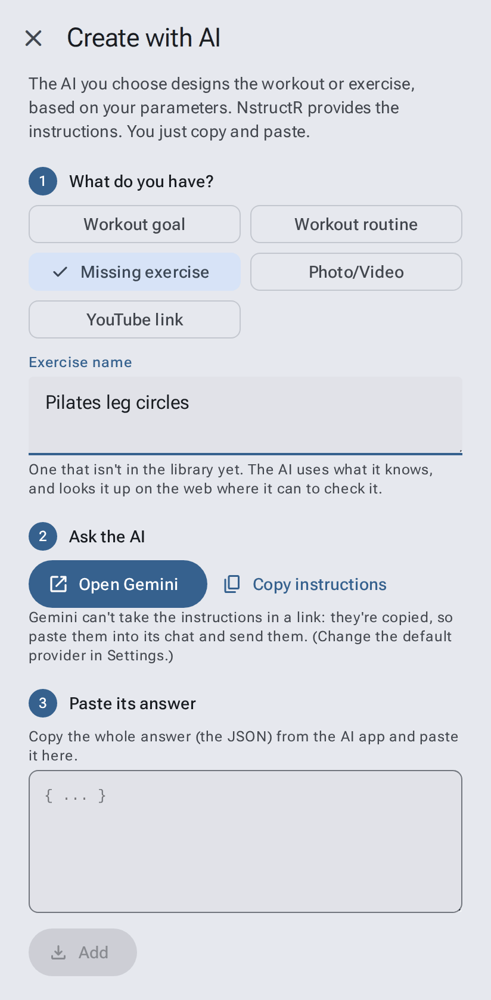
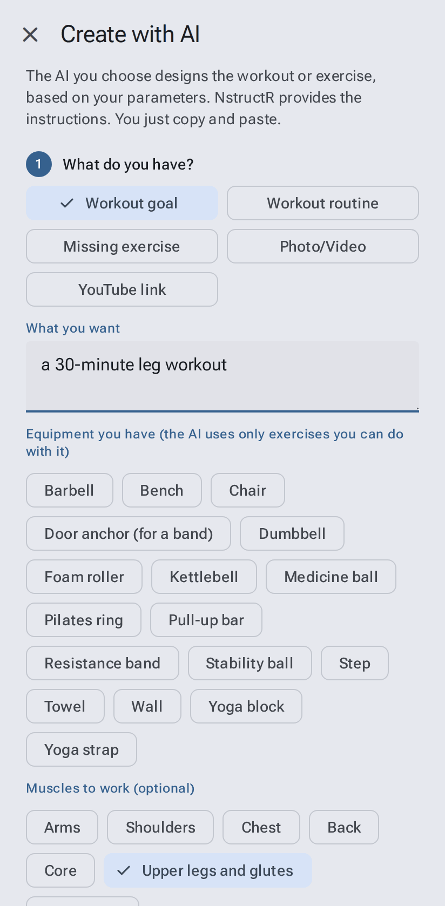
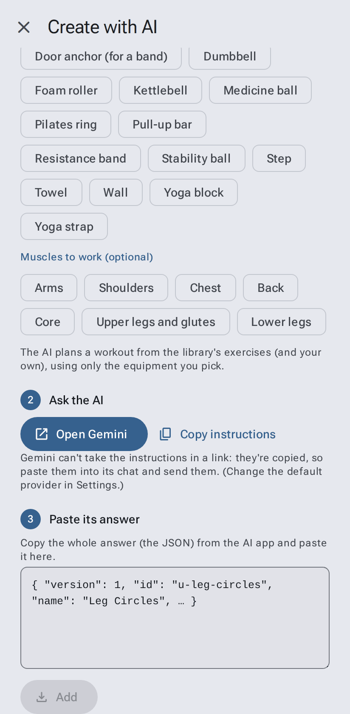
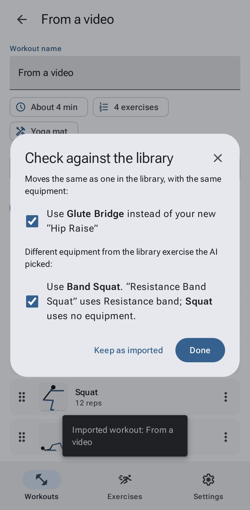

# Create with AI

[← User guide](Home.md)

Have a routine from a class, a physio's sheet, or a video? **Create with AI** gets an AI app (ChatGPT, Claude,
Copilot, DeepSeek, Doubao, Gemini, Grok, Kimi, Qwen, Vibe or any other) to turn it into an exercise or workout for NstructR. You need an
account with that AI app. NstructR doesn't send anything itself: you see everything in the AI app.

Open it from **Workouts → Create with AI** or **Exercises → My exercises → Create with AI**. The AI app it uses is
chosen in **Settings → Create with AI → Choose AI provider**.

## 1. What do you have?

| Choice | Type or paste |
|---|---|
| **Workout goal** (picked at first) | What you want, e.g. *a 30-minute leg workout*, and the equipment you have: the AI plans a workout from the exercises already in the app (see below) |
| **Workout routine** | The whole routine: exercises, reps, sets, rests |
| **Missing exercise** | The name of one that isn't in the library, e.g. *Pilates leg circles* |
| **Photo/Video** | Nothing here: attach it in the AI app after it opens (pick an app that accepts pictures or video) |
| **YouTube link** | The video's address (a web page's works too). Gemini can watch YouTube videos; most others read the page. |

The instructions ask the AI to use what it knows **and to check it with a web search** where it can (how the
exercise is done, its steps, typical reps and safety notes), and to name the page it relied on as the source.

### Workout goal: plan a workout

Tap the equipment you have (nothing is picked at first, which means no equipment; your choice is remembered), and
if you like the **muscles to work** (Back, Core…): the AI is asked to work mainly those, and you can leave the goal
empty then. The AI may use **only exercises
already in the app**, from the library or your own, that need nothing more than that equipment. It is told how long
each rep takes and the muscles each exercise mainly works, so it can fit the length and the muscles you ask for. It also gets the
[easier and harder versions](Exercises.md#variations-easier-harder-other-equipment) of each exercise, so it can suit
the level you ask for ("an easy workout", "a hard core workout"; a beginner's if you don't say).

When you add its answer:
- an exercise that isn't in the app is refused (ask the AI again);
- an exercise that needs equipment you didn't pick is added anyway, and named, so you can swap it in the workout;
- you see the workout's length as NstructR times it (rests from your settings included).

## 2. Ask the AI

Tap **Open** with the AI app you chose in **Settings → Create with AI → Choose AI provider** (listed by company and
app, e.g. **Google (Gemini)**; Gemini at first), e.g. "Open Gemini":

- **ChatGPT, Claude, Copilot**: open with NstructR's instructions already typed in when they fit in a link (planning a
  workout); the instructions for writing an exercise or workout list the whole library with every exercise's names,
  too long for a link, so they're **copied** as below. Nothing is left out to make them fit.
- **DeepSeek, Doubao, Gemini, Grok, Kimi, Qwen, Vibe**: can't be opened with a message this long, so the instructions are **copied**. Paste them into the
  chat (long-press → Paste), add your photo or video if you have one, and send.
- **Qwen** opens Alibaba's app for mainland China (qianwen.com) when your phone is set up for mainland China (its
  region or time zone), and the international one (chat.qwen.ai) everywhere else.
- **Unspecified** (last in the list): copies the instructions for you to paste into any AI chat.

The instructions are always copied too, in case the message doesn't show up. **Copy instructions** copies them
again.

## 3. Paste its answer

When the AI has answered, copy its whole reply, come back, long-press the box and choose **Paste**, then tap **Add**
(greyed out until something is pasted). If the answer can't be used, the message says why, over this screen.

- **One exercise** is added to **My exercises** and opens so you can watch it.
- **A routine** becomes a workout in **My workouts**, using library exercises where they match and new ones
  where they don't, and opens in the editor.
- If the exercise **is already in the library**, that exercise opens instead.
- **Already in the library under another name?** If a new exercise moves the same as a library one (same
  equipment, reps or hold), you're asked whether to use the library's instead (it's ticked; **Done** swaps it in
  the workout, **Keep as imported** keeps yours).
- **Different equipment?** If the AI picked a library exercise but the source uses other equipment (a band squat
  matched to the plain squat), you're offered the library's version with that equipment (Band Squat), or, when
  the library has none, your own copy with that equipment in My exercises. Names the library doesn't know yet, such as what the video
  calls an exercise, can be sent as suggestions with **Suggest it**
  (see [Submit to library](Sharing-and-backups.md#submit-an-exercise-to-the-library)).

- If the answer isn't usable, you're told why; ask the AI to try again or to "answer with only the JSON".

AI apps make mistakes. Watch a new exercise before you use it, and fix the words or poses if needed (see
[Editing exercises](Editing-exercises.md)).
