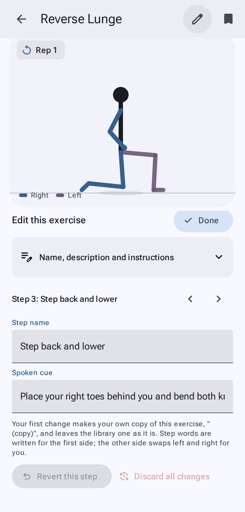
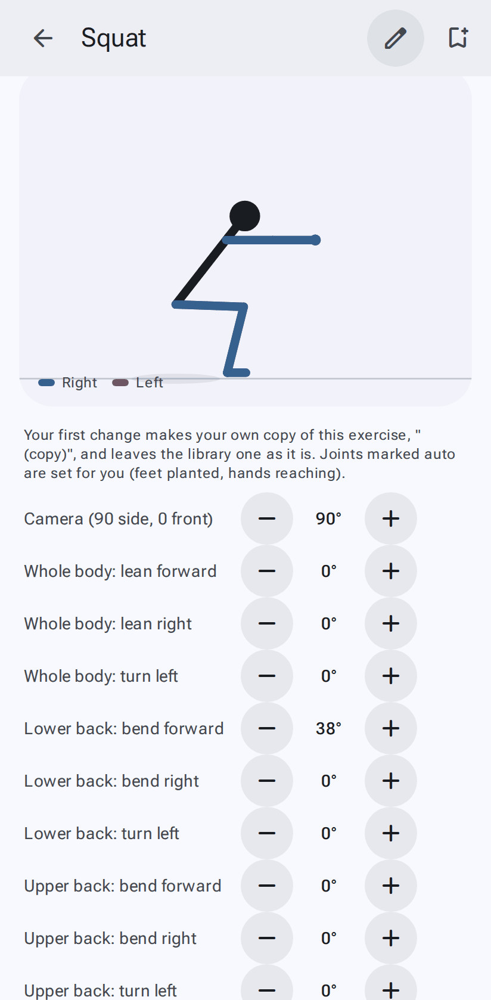

# Editing exercises

[← User guide](Home.md)

Tap the **pencil** at the top of an exercise page to edit it. The figure stays at the top of the screen while
you edit, and **Done** closes the editor.

## Changing the words (everyone)

- **Name, description and instructions**: the name, other names (separated by commas), focus, category, equipment, description,
  setup, form cues, suggested reps, note, what a rep is called, side and direction names, and source. Then
  **Muscles**: for each of the 11 groups, how much it works it (not worked, stabilizer, secondary or primary) and
  whether it's **Stretched**; the map in About changes as you go.
- **Each step**: its name and the **spoken cue** (the line read out in NstructR and NstructR+ modes). Use ‹ › to move
  between steps.
- **Spoken call** (optional): one to three words said as the step starts while the reps are counted, for exercises
  with several moves a rep ("1 … Forward. Right. Back. Left."). Leave it empty unless the next move isn't obvious; it's
  never said on a rep's first step (the count is there), and it can't be a number.
- Write steps for the first side only; the other side swaps left and right for you.

**Library exercises stay as they are.** Your first real change makes your own copy, "Name (copy)", in
**My exercises**, and you edit that. Your own exercises are edited in place. Everything saves as you go. To
suggest your change for everyone's library: **Share → Submit to library** ([how](Sharing-and-backups.md#submit-an-exercise-to-the-library)).

- **Revert this step** undoes your changes to the current step.
- **Discard all changes** goes back to how the exercise was when you started editing (and removes the copy if
  this edit made it).

## Changing the poses (Advanced exercise editor)

Turn on **Advanced exercise editor** in [Settings → Import & tools](Settings.md#import--tools) to also get the poses: the camera
(**Side** or **Front**, or any angle in between), the **camera tilt** (0 is level with the floor; 20–35 looks down from
above, for poses flat on the floor), every joint with − / + buttons (hold to repeat; steps of 1°, 5° or
15°), and the exercise's JSON.

The figure is 3D, jointed like an artist's mannequin. Hips, shoulders, the back, the head and the whole body have
three numbers each: **forward**, **side** (out to the side for an arm or leg; leaning right for the body) and
**turn**. Knees and elbows **bend**, and ankles **point** the toes. The numbers mean the same from any camera, so you
can turn the camera to check a pose from the other angle.

- Each joint has an undo that appears once it differs from where you started.
- Joints marked *auto* are placed for you (feet kept flat on the floor, hands reaching a point).
- Angles are relative to the parent limb; the figure updates as you go.
- A leg that's behind the other is drawn behind it; there's nothing to set.

The advanced exercise editor also shows JSON views elsewhere (workouts, your exercises) for people making exercises by hand.
