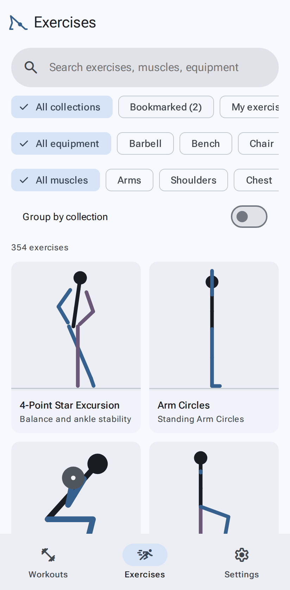
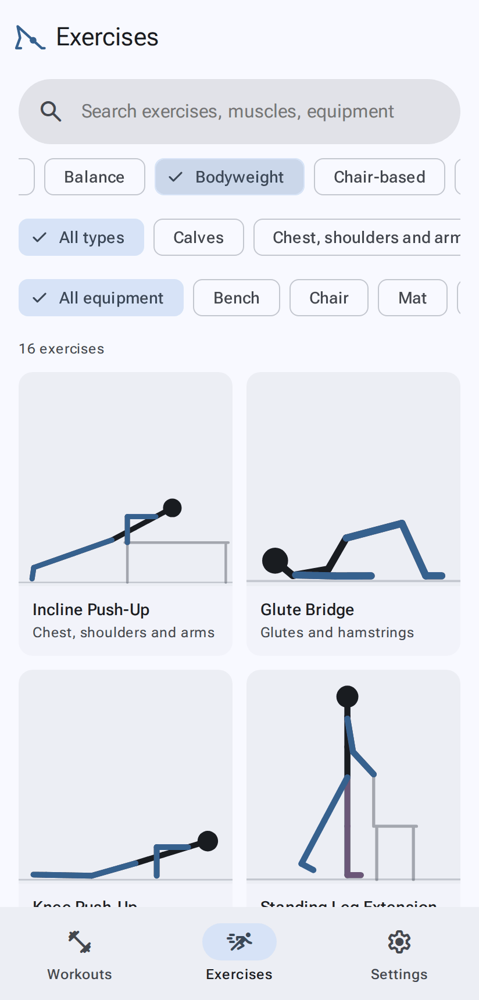
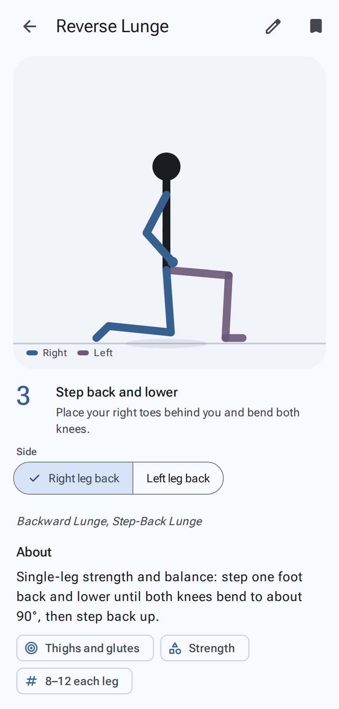
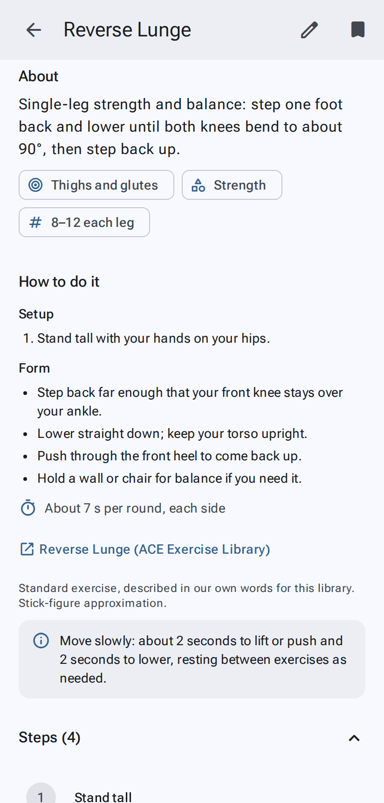

# Exercises

[← User guide](Home.md)

The **Exercises** tab is the library: over 220 exercises, each animated step by step, with written instructions.

## Finding an exercise

- **Search** looks through names, other names, muscles and equipment, including your own exercises.
- **Collections** (the first row of chips): *All collections*, then **Bookmarked**, **My exercises**, and the
  library's collections in A–Z order (Balance, Bodyweight, Chair-based, Pilates, Stretches, Yoga and more).
- Inside a collection, a second row filters by **type** (what it works, such as Calves or Core).
- The **equipment** row narrows the list to exercises that use, for example, a resistance band or a chair. Your
  equipment choice stays when you switch collections. Capital letters don't matter: an imported exercise that says
  "resistance band" is listed under Resistance band.
- **Group by collection** (under the filters, for *All collections*; off at first, and remembered):
  - **on**: with nothing filtered, a shelf per collection (**See all** opens one); with a search or filter, the
    matches under each collection they're in;
  - **off**: one list of everything that matches, A–Z.
- Inside one collection, and in Bookmarked and My exercises, exercises are listed A–Z.
- **My exercises** has **Create with AI** (as on Workouts; see [Create with AI](Create-with-AI.md)) and **Import**
  buttons, side by side.

## Bookmarks and My exercises

- Tap the **bookmark** on an exercise page to add it to **Bookmarked**. Tap it again to remove it.
- **My exercises** holds exercises that are yours: ones you imported, received in a share link, made with
  [Create with AI](Create-with-AI.md), or copied by [editing](Editing-exercises.md) a library exercise. They
  exist only on your device, so include them in your [backups](Sharing-and-backups.md#back-up-everything).
- To delete one of your own exercises, open it and use **Delete** under About. If a workout uses it, you're told
  which one first.

## The exercise page

- **The figure** plays the exercise on a loop (it starts by itself unless you turn off
  [Autoplay](Settings.md#autoplay-exercise-videos)). Tap it to show the controls: start again (from the beginning), play/pause, next step,
  and in the corner **Loop** (off: it plays once through, then stops; Play starts it again) and **Mute** (on at first: quiets the
  spoken cues on this page; unmuted, they follow Settings → Instruction). Both are remembered.
  The first tap only shows them. They stay up while paused and fade while playing.
- Under the figure: the **current step**, with its number, name and cue.
- **Side** (for exercises done one side at a time, such as *Right leg back* / *Left leg back*) and **Direction**
  (for exercises that go two ways, such as arm circles forward and backward) switch what the figure shows.
- The legend (**Right**, **Left**) tells you which colour is which limb.
- Exercises that move across the floor (Walking Lunge, Lateral Band Walk, Monster Walk, Heel-to-Toe Walk, Farmer's Carry) keep
  the figure in the middle: the marks on the floor slide past as it goes. You'll need a clear stretch of floor. Heel-to-Toe Walk goes **Forward** or **Backward** (the Direction switch).
- Pull-up bar exercises (Pull-Up, Chin-Up, Dead Hang, Hanging Knee Raise) show the bar above the figure; the view
  grows a little to fit it.
- Foam roller exercises (calves, hamstrings, quads, upper back, glutes, IT band, lats; in **Stretches** and **Warm-up**) roll back and forth
  for the time you set: the figure moves over the roller, which rolls along the floor under it (half as far, as a real
  one does). Glutes, IT band and lats are done one side at a time. Set how long in the workout (45 s at first).
- Balls move too: in the Stability Ball Hamstring Curl the ball rolls in and out under your heels; in the Stability Ball
  Pass it goes from your feet to your hands and back; in the Medicine Ball Chest Pass it flies to the wall and back.

Scroll down for the details:

- **About**: what it is, what it works, its type and suggested reps.
- **How to do it**: setup and form cues, then roughly how long one round takes (and whether that's for each
  side), where the description comes from, and any note on reps.
- **Steps**: every step in order (tap one to jump the figure to it).

### Instruction on the exercise page

The exercise page follows your **Instruction** setting (see [Settings](Settings.md#instruction)):

- **Silent** and **Beeps**: quiet.
- **Voice** and **Coach**: the first time through, each step's cue is read out and the figure waits until it's
  finished; after that it counts your reps. Pausing, switching side or direction, or leaving the page stops it.

### Share an exercise

Your own exercises have a **Share** button: see [Sharing](Sharing-and-backups.md#share-a-link).
Library exercises can be shared simply by sending the page's address.
