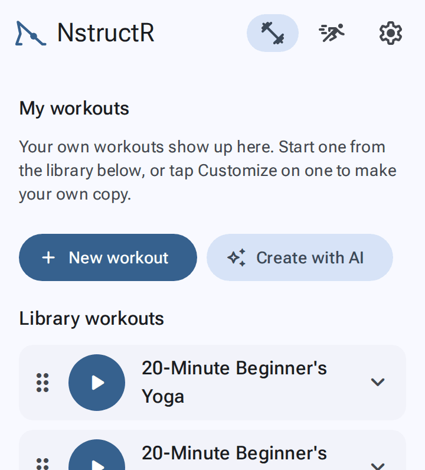

# Getting started

[← User guide](Home.md)

## Open it

Go to <https://sanicki.github.io/nstructr/> in Chrome (Android) or Safari (iPhone). Everything works straight away in
the browser.

## Install it (recommended)

Installing puts NstructR on your home screen, lets it run full screen, and lets it work **with no connection**.
It also makes your browser much less likely to clear your saved workouts when the phone is short of space.

- **Android (Chrome):** open the menu (⋮) and tap **Add to Home screen** or **Install app**.
- **iPhone (Safari):** tap **Share**, then **Add to Home Screen**.
- **Computer (Chrome or Edge):** click the install icon at the right of the address bar.

Updates arrive by themselves the next time you open the app while online.

## The three tabs

| Tab | For |
|---|---|
| **Workouts** | Starting a workout, making your own, your history |
| **Exercises** | Looking up how to do an exercise, bookmarking favourites |
| **Settings** | Instruction (sound) and speech speed, theme, rest between exercises, Create with AI, backups |

On a phone the tabs are at the bottom. On short screens (the cover screen, or a phone on its side) they move to
the top bar as icons, to keep clear of the camera cutouts.

## On a flip phone's cover screen

NstructR is designed so you can fold the phone, put it on the floor in front of your mat, and follow along on
the cover screen:

- Install the app first (see above). Installed apps run on the cover screen.
- Nothing you need to tap sits at the bottom of the screen, where the cameras are.
- The first tap only shows the controls, so you can't pause or skip by accident. To leave a workout, **hold ✕**.
- The screen stays on while you work out.

See [Working out](Working-out.md) for the controls.

## Where next

- Try a workout: on **Workouts**, tap ▶ on **20-Minute Beginner's Yoga** (or Pilates, Free Weights, Kettlebell).
- Look up an exercise: open **Exercises** and tap any card.
- Make your own workout: [Workouts](Workouts.md#make-your-own).
