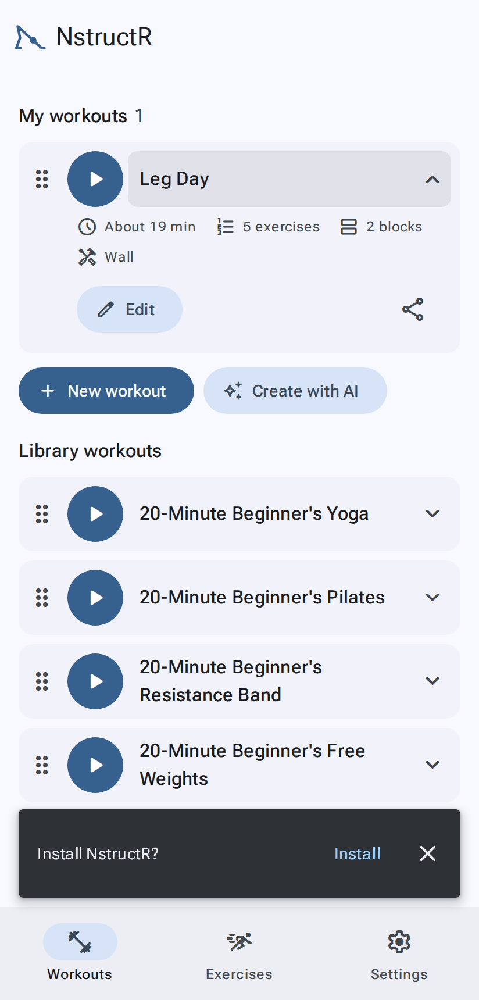
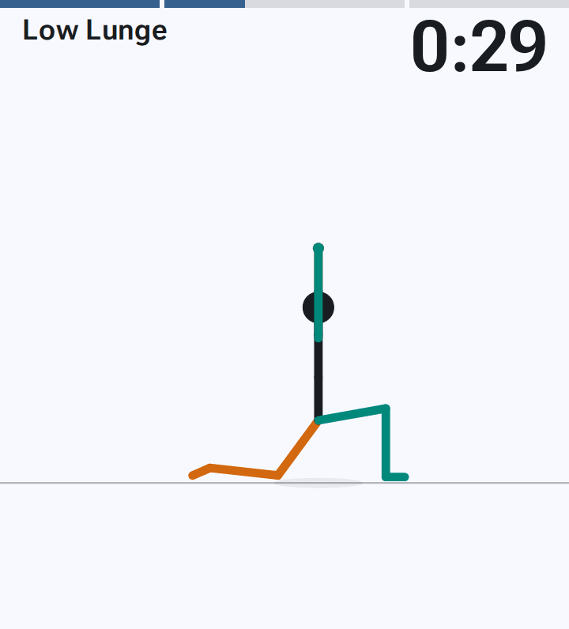
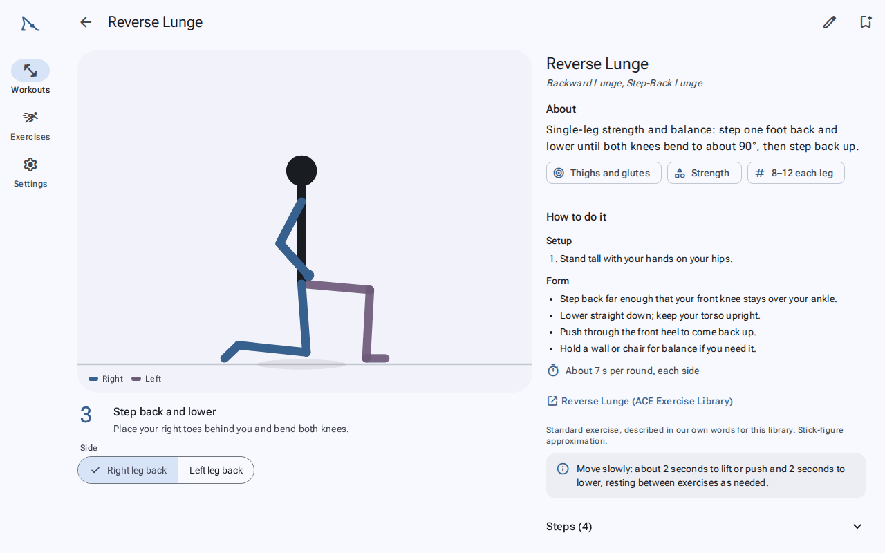

# Getting started

[← User guide](Home.md)

## Open it

Go to <https://sanicki.github.io/nstructr/> in Chrome (Android) or Safari (iPhone). Everything works straight away in
the browser.

## Install it (recommended)

Installing puts NstructR on your home screen, lets it run full screen, and lets it work **with no connection**.
It also makes your browser much less likely to clear your saved workouts when the phone is short of space.

NstructR offers it once, after your first workout (finished or stopped early), if your browser can install it:
"Install NstructR?" Tap **Install** (or on an iPhone, **How**).

You can also install it from **Settings → Import & tools → Install app**, or from the browser:

- **Android (Chrome):** open the menu (⋮) and tap **Install and create shortcut** (or **Add to Home screen**).
- **iPhone (Safari):** tap **Share**, then **Add to Home Screen**.
- **Computer (Chrome or Edge):** click the install icon at the right of the address bar.

Updates arrive by themselves the next time you open the app while online.

## The three tabs

| Tab | For |
|---|---|
| **Workouts** | Starting a workout, making your own, your history |
| **Exercises** | Looking up how to do an exercise, bookmarking favourites |
| **Settings** | Instruction (sound) and speech speed, theme, rest between exercises, Create with AI, backups |

On a phone the tabs are at the bottom. On short screens (the cover screen, or a phone on its side) they move to
the top bar as icons, to keep clear of the camera cutouts.

## On a flip phone's cover screen

NstructR is designed so you can fold the phone, put it on the floor in front of your mat, and follow along on
the cover screen:

- Install the app first (see above). Installed apps run on the cover screen.
- Nothing you need to tap sits at the bottom of the screen, where the cameras are.
- The first tap only shows the controls, so you can't pause or skip by accident. To leave a workout, **hold ✕**.
- The screen stays on while you work out.

See [Working out](Working-out.md) for the controls.

## On a laptop or desktop

NstructR isn't only for phones. It's a web app, so the same address works in any modern browser, and on a computer
it spreads out: the figure on one side, the instructions on the other. It's handy for planning workouts, looking up
exercises on a big screen, or following along on a TV or laptop.

- **Install it** there too: in Chrome or Edge, click the install icon at the right of the address bar (or the
  menu ⋮ → **Cast, save, and share → Install page as app**, in Edge **Apps → Install this site as an app**). In
  Safari on a Mac, **File → Add to Dock**. It then opens in its own window and works offline.
- **Your devices don't sync.** Each browser keeps its own workouts, history and settings, with no account. To move
  things between your phone and your computer:
  - **One workout or exercise:** open it, tap **Share**, and on the other device scan the **QR code** or open the
    link. It's added when you tap **Add**. A computer's big screen makes the QR code easy to scan with your phone.
  - **Everything:** **Settings → Import & tools → Export everything** on one device, then **Import** that file on
    the other. It adds the file's workouts, exercises and history to what's there (nothing is deleted) and takes
    its settings.

  See [Sharing, importing and backups](Sharing-and-backups.md).

## Where next

- Try a workout: on **Workouts**, tap ▶ on **20-Minute Beginner's Yoga** (or Pilates, Resistance Band, Free Weights, Kettlebell).
- Look up an exercise: open **Exercises** and tap any card.
- Make your own workout: [Workouts](Workouts.md#make-your-own).
