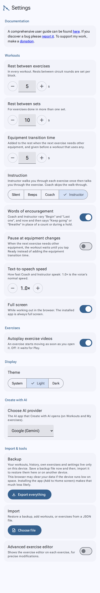

# Settings

[← User guide](Home.md)

## Documentation

A link to this guide, and **report it** to tell us about a bug: it opens a short form on GitHub (you need a free
GitHub account) with your phone and browser already filled in. Say what went wrong in a sentence or two; a
screenshot helps.

And a link to make a **donation**, if you'd like to support the work.

## Workouts

### Rest between exercises
Seconds of rest between one exercise and the next, in every workout. Tap − / + (1 s at a time; hold to keep
going) or type a number, from 0 to 300. Default 5.

### Rest between sets
Seconds of rest between the sets of an exercise done in more than one set, in every workout. Same controls.
Default 10. (Rest between circuit rounds is set on each block.)

### Equipment transition time
Seconds added to the rest when the next exercise needs other equipment (time to put things down and get the next),
and the length of **Get ready** before a workout that uses any. Same controls. Default 5. See
[Working out → Equipment](Working-out.md#equipment).

### Instruction
**Silent**, **Beeps**, **Coach** or **Instructor** (the default): see [Working out → Instruction](Working-out.md#instruction). Also used
by the exercise page (Coach and Instructor read each step's cue once, then count).

### Words of encouragement
Shown with **Coach** and **Instructor** (on at first). They vary their words: **Begin**, **Ready** or **Go** to start; **Last one**,
**One more** or **Last rep** for the last rep; and now and then **Good**, **Keep going**, **Breathe** or **Doing
great**: in place of about 1 in 5 counts (never the first or the last; 1 in 10 right after a count that was replaced),
and every 10 seconds of a hold, 4 times in 10 (never at halfway or in the last 10 seconds). The same word is never
used twice in a row ("Good. Breathe. Good.", not "Good. Good."). Off: always "Begin", the numbers and "Last one".

### Pause at equipment changes

Off at first. When the next exercise needs other equipment (and at the **Get ready** list before a workout with
equipment), the workout waits until you tap **Ready** instead of adding the equipment transition time. See
[Working out → Equipment](Working-out.md#equipment).

### Text-to-speech speed
How fast Coach and Instructor speak, from **0.5×** to **3.0×** in steps of 0.1 (**1.0×** is the voice's normal speed).
Tap − or +, or hold one to keep going; you hear a short sample at the new speed.

### Full screen
Whether a workout in the browser goes full screen. The installed app is always full screen.

## Exercises

### Autoplay exercise videos
On (the default): an exercise starts moving as soon as you open it. Off: it waits until you tap Play. (If your
phone is set to reduce motion, exercises wait for Play either way.)

## Display

### Theme
**System** (follows your phone), **Light** or **Dark**.

## Create with AI

**Choose AI provider**: the AI app that [Create with AI](Create-with-AI.md) opens, listed by company and app, e.g.
**Google (Gemini)** (Gemini at first). Create with AI itself is on **Workouts** and **My exercises**.

## Import & tools

- **Install app** (only while your browser can install it, and not in the installed app): **Install** puts NstructR
  on your home screen. On an iPhone it says how (Share, then Add to Home Screen).
- **Backup**: Export everything. See [Backups](Sharing-and-backups.md#back-up-everything).
- **Import**: Choose file: restore a backup (you choose to **Merge** it with what's here or **Replace** what's here), or add workouts or exercises.
- **Export your exercises** (Advanced exercise editor): the JSON of everything in My exercises.
- **Advanced exercise editor**: shows the exercise editor on each exercise, for precise modifications: the poses, the camera and JSON views. See
  [Editing exercises](Editing-exercises.md#changing-the-poses-advanced-exercise-editor).
- **JSON format reference** (Advanced exercise editor): the file formats, for people writing exercises by hand.
