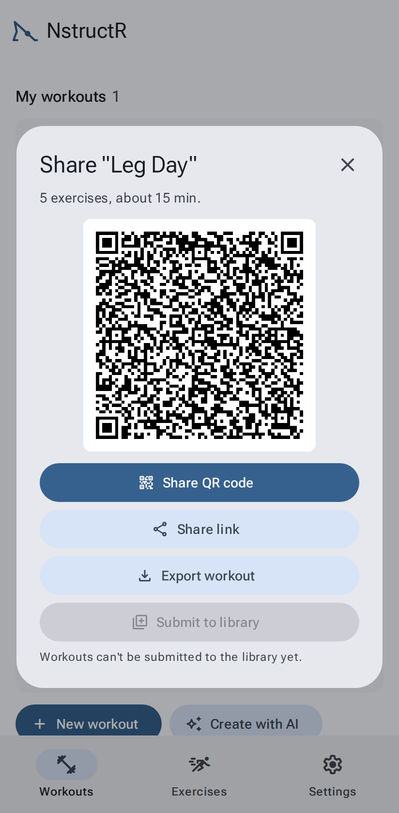
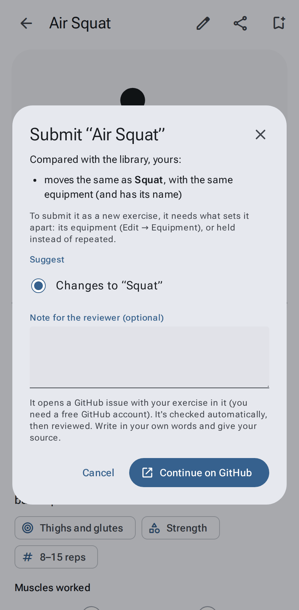
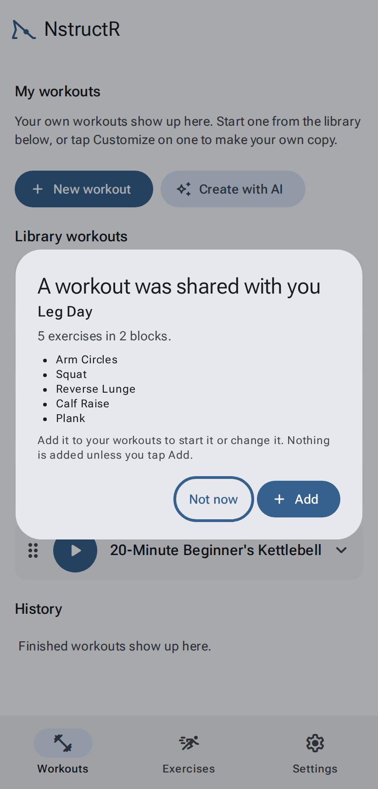

# Sharing, importing and backups

[← User guide](Home.md)

## Share a link

**Share** on one of your workouts (or on one of your own exercises) makes a link that **carries the whole thing
inside it**: no account and no server. Send it any way you like, or let someone scan the QR code.

- **Share QR code** (recommended): the QR code as a picture, for the other person to scan. Very long links get no
  QR code; then **Share link** is the one to use.
- **Share link**: your phone's share sheet (on a computer, the link is copied).
- **Export workout** / **Export exercise**: a small `.json` file instead.
- **Submit to library**: suggest your exercise, or your change to a library exercise, for everyone. See
  [below](#submit-an-exercise-to-the-library). (Workouts can't be submitted yet.)
- Close with ✕, Esc, or your phone's Back.

Library workouts and exercises don't need sharing: everyone has them. Send the page's address instead.

## Submit an exercise to the library

Made an exercise the library doesn't have, fixed one, or know another name for one? Open it, tap **Share**, then
**Submit to library**. You need a (free) GitHub account: the app fills in a form there for you.

The app first compares it with the library, so the library doesn't end up with the same exercise twice:

- **Only the name is different** from the library exercise you copied: it's suggested as **another name** for it
  (other names show under the name, and search finds them).
- **You changed a library exercise**: it's suggested as **changes to** that exercise.
- **It moves the same as one in the library, with the same equipment**: it can be another name for that one, or
  changes to it. To send it as a new exercise, give it what sets it apart first: its equipment (Edit → Equipment),
  or held instead of repeated.
- **A library exercise already has its name**: rename yours first.
- Otherwise: **a new exercise**.

Add a note for the reviewer if you like, then **Continue on GitHub**, tick the box (your own words, sources cited,
shared under the MIT license) and submit. Within a few minutes a check comments on it: the same checks every
library exercise passes (the figure doesn't float or sink, every pose is one a body can do, no duplicates). If it
passes, it waits for review; if not, the comment says what to fix. Write in your own words and add a source link
(Edit → Source link).

## Receiving

Opening a shared link shows what's in it. **Nothing is added until you tap Add.**

A shared workout that uses the sender's own exercises brings them along. If you already have a different
exercise with the same name, the new one gets its own name, so nothing of yours is overwritten.

## Import a file

**Settings → Import & tools → Import → Choose file** adds a backup, workouts, or exercises. On a
computer you can also drop a file anywhere on the page.

## Back up everything

Your data lives only in this browser on this device. **Settings → Import & tools → Export everything** saves one
file with your workouts, history, your own exercises, bookmarks, every setting (rests, Instruction, speech speed,
theme, full screen, autoplay, authoring mode), the choices the app remembers (the exercise page's Loop and Mute,
grouping by collection, Create with AI's app and equipment, your order of the library workouts) and an unfinished
workout to resume. Importing it (**Import → Choose file**) restores it,
here or on another device.

Make a backup now and then, and before clearing your browser's data or changing phones. Installing the app
makes it much less likely that the browser clears your data by itself; Settings tells you whether your storage
is protected.
