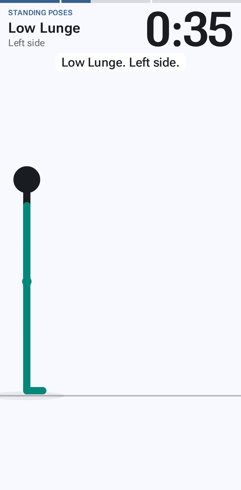
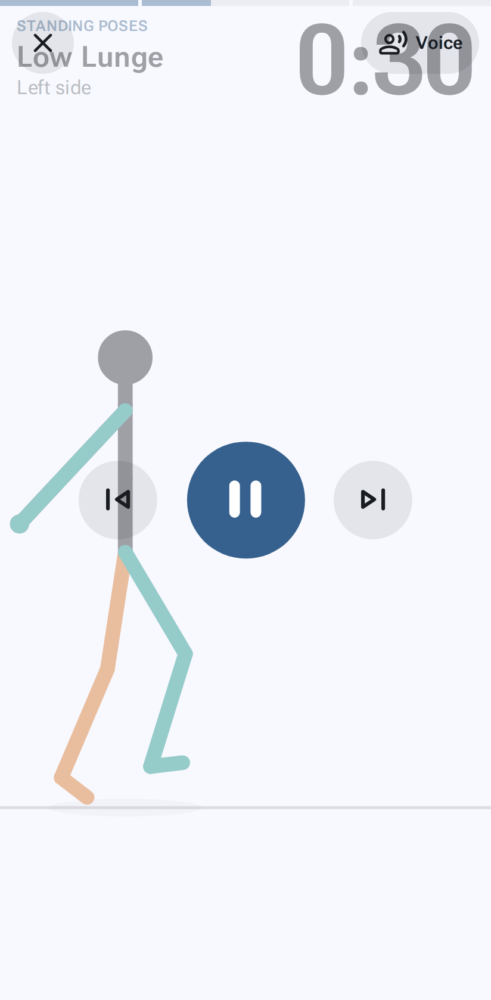
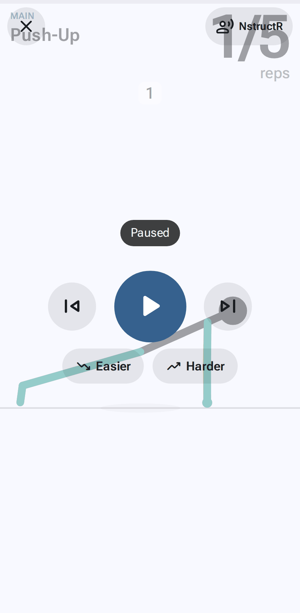

# Working out

[← User guide](Home.md)

Tap ▶ on a workout to start. The player fills the screen with the figure, the exercise's name, the count, and a
caption of what's being said.

## Controls

| To | Do this |
|---|---|
| Show the controls | Tap anywhere. (The first tap only shows them.) |
| Pause / play | Show the controls, then tap the big button |
| Previous / next step | The buttons either side of it |
| Next / previous **exercise** | Swipe left / right (with the controls hidden) |
| Hide the controls | Tap an empty spot, or wait: they fade after a few seconds while playing |
| **Leave the workout** | **Hold ✕** for about a second. A tap only reminds you to hold. |
| Pause with a keyboard | Space |
| Leave with a keyboard | Esc (or Tab to ✕ and press Enter) |
| Leave with a screen reader | Double-tap ✕ (TalkBack and VoiceOver don't need the hold) |

The chip at the top right shows the **sound** mode; tap it to change it for this workout.

## Too easy or too hard?

When the exercise has an easier or harder version, the controls show **Easier** and **Harder** under the play buttons.

- Tap one to switch to that version. It starts the set again from the first rep (or 0:00), with NstructR+'s run-through
  if NstructR+ is on; what you'd done doesn't carry over. The rest of that exercise's sets, and later rounds, use it too.
- The swap is only for this workout. When you leave the player, you're asked **Keep these changes in the
  workout?** Keep saves them (for a library workout, in your own copy); **Don't keep** leaves the workout as it was.
- **Resume** keeps a swap. In **History**, sets you finished before swapping count as the exercise you did them as.

## Rests

Between exercises (and sets and rounds) a big countdown shows what's next. **+15 s** adds time; **Skip** moves
on. Beeps count down the last 3 seconds in Beeps, NstructR and NstructR+ modes.

### Equipment

A workout that uses equipment starts with a title card: the workout's name and a list of what you'll need (for example
dumbbells and a chair). It's said aloud too, and the workout carries on once all of it has been said; **Start** begins
straight away. When the next exercise needs other equipment, it says what to do, on the screen and in NstructR and
NstructR+ modes: "Put the dumbbells down · Position yourself by your chair", and gives you as long as that takes to
say, with half a second before and after (about 4–5 seconds; longer at a slower
[text-to-speech speed](Settings.md#text-to-speech-speed)). With a rest, that's added to the rest. With no rest between
exercises there's no rest screen: the figure takes that long to move into the next exercise while the words are said
and shown. The workout's time includes it. The yoga mat stays down, so it doesn't count. With
**[Pause at equipment changes](Settings.md#pause-at-equipment-changes)** on, the workout waits for you to tap
**Ready** instead.

### Changing position

When the next exercise starts in another position (standing, kneeling, on all fours, sitting, lying on your back,
front or side, plank, a squat with the hands down, Downward Dog or Dolphin), it also says how to get there while the
figure moves: "Lower to the floor and roll onto your back.", "Lower to your left side, stacking your hips and knees."
With equipment too, it comes in the order you'd do it: "Put the dumbbells down. Sit down on your mat with feet flat or
legs crossed. Pick up the resistance band." It's timed the same way as an equipment change (added to the rest, or the move takes that long
with no rest) and shown on the rest screen. **Pause at equipment changes** doesn't wait for a change of position alone.

## Instruction

| Mode | You hear |
|---|---|
| **Silent** | Nothing. Captions still show what would be said. |
| **Beeps** | A 3-2-1 before rests and holds end, a chime when switching |
| **NstructR** (the default) | The exercise's name ("Set 2", "Set 3" for its next sets), side and direction switches, rests, what's next; "Ready… Begin." then counted reps (1, 2, 3 … "Last one"; in some multi-step exercises a word for each move, like a star excursion's "1 … Forward. Right. Back. Left."; alternating sides or directions, where a rep is one side then the other: "1 and 2 and 3 …"), "Ready… Hold for 30 seconds." then "Halfway" and "10 seconds" in holds, with [words of encouragement](Settings.md#words-of-encouragement) |
| **NstructR+** | NstructR, plus a **demonstration** when you come to an exercise ("Squat. Watch me first. …"), and for each side or direction the first time it comes up, but not again for the next sets of it: one slow pass reading every step's cue (for a hold, the pose's cue, then "Ready… Hold for 30 seconds." and the countdown starts) |

The voice is your phone's own text-to-speech, so it works offline. It never talks over itself: a count is skipped
rather than interrupting a sentence. Its speed is a setting ([Text-to-speech speed](Settings.md#text-to-speech-speed)). Pausing stops it; playing again re-reads the current step.

## Stopping and resuming

- Your place is saved after every exercise. If you leave (hold ✕, or the phone locks), a **Resume** card on the
  Workouts tab takes you back.
- A finished workout goes into **History**.

## Full screen and the screen staying on

In the browser, workouts go full screen unless you turn that off in [Settings](Settings.md#full-screen). The
installed app is always full screen. The screen stays on while a workout plays.
