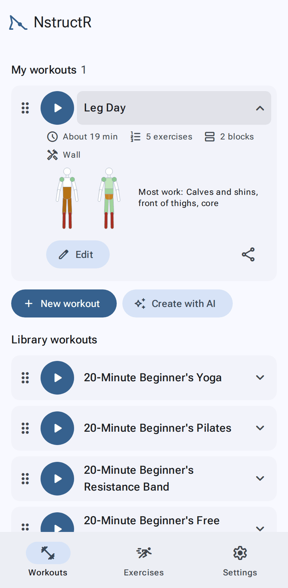
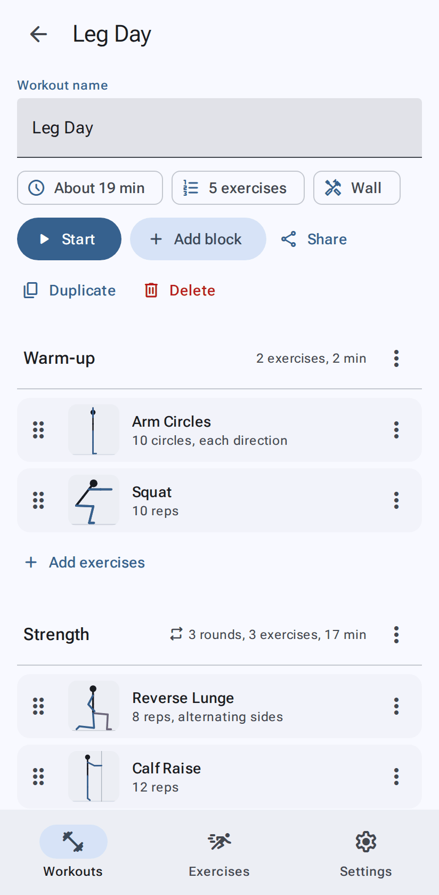
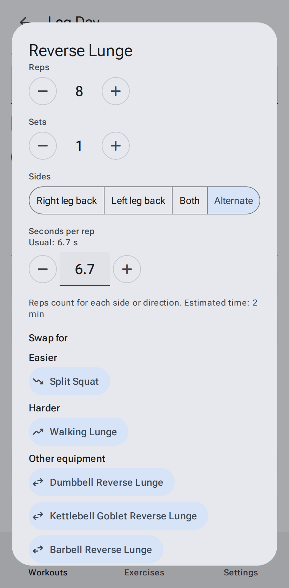

# Workouts

[← User guide](Home.md)

The **Workouts** tab has three parts:

- **My workouts**: the ones you made, customised or received. Tap a card to expand it (time, number of exercises,
  equipment, safety notes, **Edit**, **Share**). Tap ▶ to start.
- **Library workouts**: ready-made routines. Start one as it is, or tap **Customize** to make your own copy. There
  are 20-minute beginner's workouts for yoga and Pilates (a mat, nothing else), resistance band (one band), free
  weights (dumbbells) and kettlebell (one bell). The 20 minutes are with **Coach** (Settings › Instruction); without it they take 15–17.
- **History**: finished workouts, with the date, how long they took and how many exercises you did. Delete an
  entry with its bin, or **Clear** all of them.

If you stop a workout part-way, a **Resume** card at the top takes you back to where you were.

### Arrange and delete

- **Reorder**: drag a card by its handle (⠿). This works for library workouts too; the order is yours.
- **Delete** one of your workouts: swipe it left and tap the bin. (Or open it and tap **Delete**.)

## Make your own

- **New workout** starts an empty one.
- **Customize** on a library workout copies it into My workouts.
- **Create with AI** writes one from a routine you have: see [Create with AI](Create-with-AI.md).
- Workouts people send you arrive by link or file: see [Sharing](Sharing-and-backups.md).

## The workout editor

- **Name** at the top; below it, the estimated time, the number of exercises and the equipment you'll need.
- **Start**, **Add block**, **Share**, **Duplicate** and **Delete**.
- A workout is made of **blocks** (Warm-up, Strength, Cool-down…). Each block has a menu (⋮) to rename, move,
  delete it, or **repeat it as a circuit**: every exercise in the block, then back to the top, for a number of
  **rounds** with a **rest between rounds**.
- **Add exercises** opens a searchable picker; tick as many as you like, then **Add**.
- Drag an exercise by its handle to reorder it, even into another block. Its menu (⋮) can move, duplicate, view or
  remove it.
- Changes save as you go.

### An exercise's settings

Tap an exercise in the editor to set how it's done:

| Setting | What it does |
|---|---|
| **Reps** or **Hold for** | Reps for rep-based exercises; seconds for holds (planks, stretches) |
| **Sets** | Do it this many times in a row (the rest between sets is a [setting](Settings.md#rest-between-sets)) |
| **Sides** | For one-sided exercises: one side only, **Both** (all reps on one side, then the other), or **Alternate** (switch every rep). Reps count per side. |
| **Direction** | For exercises that go two ways: one way, **Both**, or **Alternate** |
| **Order** | With both sides and/or both directions: the order they come in, e.g. both directions on the right leg, then the left, or each direction on both legs before the next. Move a line with ↑ ↓. |
| **Seconds per rep** | How long one rep takes. *Usual* is the exercise's own pace. Type a number or use − / + (0.1 s steps). |

The estimated time updates as you change things.

**Swap for**: an exercise with [variations](Exercises.md#variations-easier-harder-other-equipment) lists them at the
bottom (**Easier**, **Harder**, **Other equipment**). Tap one to swap: the dialog shows the new exercise ("Swapped
from …"); **Save** keeps it, **Cancel** doesn't. Sets, sides and direction stay; reps or seconds stay when both count
the same way (a hold swapped for reps gets the new exercise's usual reps); the pace goes back to the new exercise's own.

## Rests

- **Rest between exercises** and **rest between sets** are settings for all workouts, in
  [Settings](Settings.md#rest-between-exercises) (defaults 5 s and 10 s, 1 s steps).
- **Rest between rounds** is set on each block (circuits).
